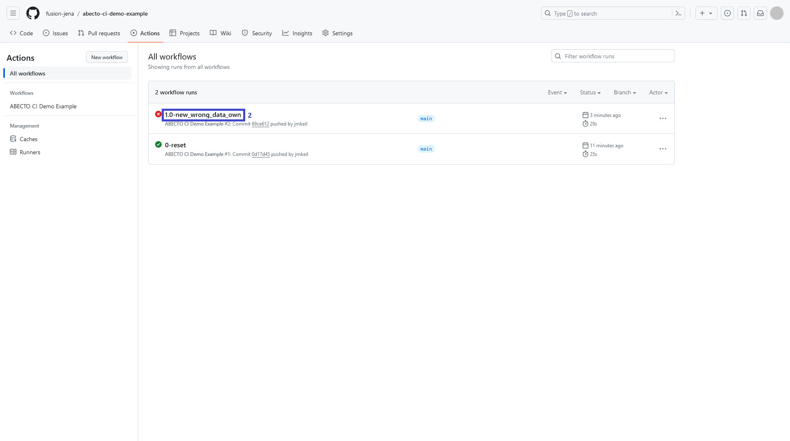

# Demonstration: Continuous Knowledge Graph Quality Assessment through Comparison using ABECTO

This demonstration showcases the use of [ABECTO](https://github.com/fusion-jena/abecto) in a [CI](https://en.wikipedia.org/wiki/Continuous_integration) pipeline to monitor the quality of an RDF knowledge graph.

## Requirements to run the demonstration

* [empty GitHub repository](https://github.com/new)
* [Git](https://git-scm.com/)
* Bash or similar unix shell
    * For Windows we recommend to use Git Bash shipped with [Git for Windows](https://gitforwindows.org/)

## Preparation

1. copy all files of the demonstration into a local folder
2. edit first line of [0-reset.sh](0-reset.sh) to point to the empty GitHub repository
3. execute [0-reset.sh](0-reset.sh) to initialize the repository (this step can be repeated anytime to restart the demonstration)

## Run the Demonstration

The demonstration offers 4 scenarios starting with a change to one of the knowledge graphs (own or other).
Each of these changes results in a new deviation between the knowledge graphs.
Then, one can either adapt the own knowledge graph or ignore the deviating value of the other knowledge graphs by marking them as wrong.
Of course, only one of the options is reasonable in each scenario.

1. Add some data to the own knowledge graph that contain errors: [1.0-new_wrong_data_own.sh](1.0-new_wrong_data_own.sh)
    * Fix the wrong values in the own knowledge graph: [1.1-adapt_own.sh](1.1-adapt_own.sh)
    * Ignore the correct values from other knowledge graphs: [1.2-ignore_other.sh](1.2-ignore_other.sh)
2.  Add some data to the own knowledge graph that are correct: [2.0-new_correct_data_own.sh](2.0-new_correct_data_own.sh)
    * Change the correct values in the own knowledge graph: [2.1-adapt_own.sh](2.1-adapt_own.sh)
    * Ignore the wrong values from other knowledge graphs: [2.2-ignore_other.sh](2.2-ignore_other.sh)
3.  Add some data to other knowledge graphs that are correct: [3.0-new_correct_data_other.sh](3.0-new_correct_data_other.sh)
    * Fix the wrong values in the own knowledge graph: [3.1-adapt_own.sh](3.1-adapt_own.sh)
    * Ignore the correct values from other knowledge graphs: [3.2-ignore_other.sh](3.2-ignore_other.sh) 
4. Add some data to other knowledge graphs that contain errors: [4.0-new_wrong_data_other.sh](4.0-new_wrong_data_other.sh)
    * Change the correct values in the own knowledge graph: [4.1-adapt_own.sh](4.1-adapt_own.sh)
    * Ignore the wrong values from other knowledge graphs: [4.2-ignore_other.sh](4.2-ignore_other.sh)

Further possible actions:
* Make custom changes to the knowledge graphs or the ABECTO configuration and afterwards commit and push them: [5-custom_push.sh](5-custom_push.sh)
* Reset the repository to the initial state: [0-reset.sh](0-reset.sh)

In case you don't want to execute the demonstration on your own, you can visit an [example repository with pre-executed scenarios](https://github.com/fusion-jena/abecto-ci-demo-example/actions) (action sequence: 1.0, 1.1, 2.0, 2.2, 3.0, 3.1, 4.0, 4.2).

After each change, the CI pipeline will be executed and the results can be inspected in the GitHub user interface using the *Actions* link (1):

Depending on the current status, the CI pipeline execution ends with a success or a failure.
More information about the CI pipeline execution are accessible using the according link (2) in the executions list:

In case of a failure, the deviations can be inspected using the according link (3) in the sidebar:

In each case, measurements results can be inspected using the according link (4) in the sidebar:

## Examples on Real World Knowledge Graphs

* [Comparison and Evaluation of Unit Ontologies with ABECTO](https://github.com/fusion-jena/abecto-unit-ontology-comparison)
* [Comparison of Space Travel Data in Wikidata and DBpedia with ABECTO](https://github.com/fusion-jena/abecto-space-travel-comparison)